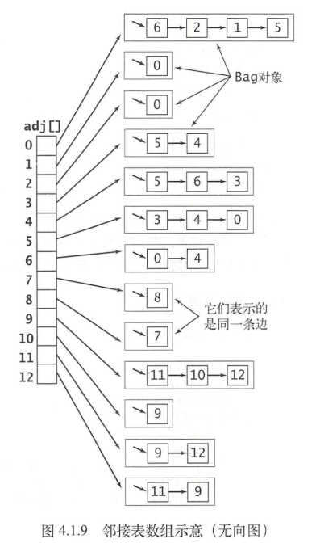

图的表示方法：

- **邻接矩阵**。我们可以使用一个`V`乘`V`的布尔矩阵。当顶点 v 和顶点 w 之间有相连接的边时，定义 v 行 w 列的元素值为 true，否则为false。
- **边的数组**。我们可以使用一个Edge 类，它含有两个int 实例变量 。 
- **邻接表数组**。我们可以使用一个以顶点为索引的列表数组，其中的每个元素都是和该顶点相邻的顶点列表，参见图 4.1.9。 。  

